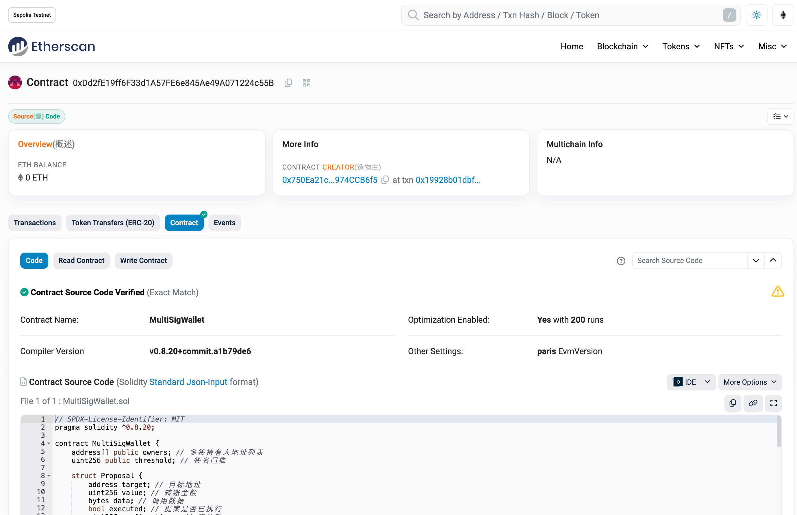

# MultiSigWallet 学习笔记

## 1. 介绍

### 1.1. 什么是MultiSigWallet

MultiSigWallet 是一种多签钱包，它允许多个账户共同控制一个钱包的资产。在MultiSigWallet中，每个账户都有一个权重，这个权重决定了该账户在交易中的投票权。只有当足够的账户（即权重之和大于等于总权重）投票同意后，交易才能被执行。

### 1.2. MultiSigWallet 的应用场景

MultiSigWallet 可以用于各种需要多个账户共同决策的场景，例如：

- 共同控制公司资产
- 共同管理基金

- 共同控制数字货币资产
- 共同管理智能合约

### 1.3. MultiSigWallet 的优点

MultiSigWallet 的优点包括：

- 安全性高：由于需要多个账户共同决策，因此即使某个账户被攻击，也不会影响整个钱包的安全。
- 灵活性高：可以根据需要设置不同的权重，以适应不同的场景。
- 可扩展性高：可以添加或删除账户，以适应团队的变化。

## 2. 实现

```shell
forge init MultiSigWallet
cd MultiSigWallet/
code .
touch .env   
touch StudyNotes.md      
```

## 目录结构

```shell
MultiSigWallet on  master [!+?] via 🅒 base 
➜ tree . -L 6 -I 'lib|out|broadcast|cache'

.
├── README.md
├── StudyNotes.md
├── foundry.toml
├── image.png
├── remappings.txt
├── script
│   ├── Counter.s.sol
│   └── MultiSigWallet.s.sol
├── src
│   ├── Counter.sol
│   ├── MultiSigWallet.sol
│   └── MyToken.sol
└── test
    ├── Counter.t.sol
    └── MultiSigWalletTest.sol

4 directories, 12 files

```

## 代码

## 测试

```shell
MultiSigWallet on  master [!+?] via 🅒 base took 4.9s 
➜ forge fmt && forge test --match-path ./test/MultiSigWalletTest.sol --show-progress  -vv  
[⠊] Compiling...
No files changed, compilation skipped
test/MultiSigWalletTest.sol:MultiSigWalletTest
  ↪ Suite result: ok. 8 passed; 0 failed; 0 skipped; finished in 10.88ms (13.55ms CPU time)

Ran 8 tests for test/MultiSigWalletTest.sol:MultiSigWalletTest
[PASS] testCancelProposal() (gas: 79855)
[PASS] testConfirmProposal() (gas: 218775)
[PASS] testConfirmProposalBelowThreshold() (gas: 148443)
[PASS] testConfirmProposalByDifferentOwners() (gas: 219828)
[PASS] testConfirmProposalSuccessful() (gas: 217422)
[PASS] testInvalidProposal() (gas: 70026)
[PASS] testRepeatedConfirmation() (gas: 212759)
[PASS] testSubmitProposal() (gas: 119132)
Suite result: ok. 8 passed; 0 failed; 0 skipped; finished in 10.88ms (13.55ms CPU time)

Ran 1 test suite in 348.70ms (10.88ms CPU time): 8 tests passed, 0 failed, 0 skipped (8 total tests)

```

## 部署

```shell
MultiSigWallet on  master [!+?] via 🅒 base 
➜ source .env                                                  

MultiSigWallet on  master [!+?] via 🅒 base took 17.6s 
➜ forge script --chain sepolia MultiSigWalletScript --rpc-url $SEPOLIA_RPC_URL --account MetaMask --broadcast --verify -vvvv  

[⠊] Compiling...
No files changed, compilation skipped
Traces:
  [1144342] MultiSigWalletScript::run()
    ├─ [0] VM::envUint("PRIVATE_KEY") [staticcall]
    │   └─ ← [Return] <env var value>
    ├─ [0] VM::envAddress("ACCOUNT_ADDRESS") [staticcall]
    │   └─ ← [Return] <env var value>
    ├─ [0] VM::addr(<pk>) [staticcall]
    │   └─ ← [Return] 0x750Ea21c1e98CcED0d4557196B6f4a5974CCB6f5
    ├─ [0] VM::startBroadcast(<pk>)
    │   └─ ← [Return] 
    ├─ [1028302] → new MultiSigWallet@0xDd2fE19ff6F33d1A57FE6e845Ae49A071224c55B
    │   └─ ← [Return] 4462 bytes of code
    ├─ [0] console::log("MultiSigWallet deployed to:", MultiSigWallet: [0xDd2fE19ff6F33d1A57FE6e845Ae49A071224c55B]) [staticcall]
    │   └─ ← [Stop] 
    ├─ [0] VM::stopBroadcast()
    │   └─ ← [Return] 
    └─ ← [Stop] 


Script ran successfully.

== Logs ==
  MultiSigWallet deployed to: 0xDd2fE19ff6F33d1A57FE6e845Ae49A071224c55B

## Setting up 1 EVM.
==========================
Simulated On-chain Traces:

  [1028302] → new MultiSigWallet@0xDd2fE19ff6F33d1A57FE6e845Ae49A071224c55B
    └─ ← [Return] 4462 bytes of code


==========================

Chain 11155111

Estimated gas price: 39.158879778 gwei

Estimated total gas used for script: 1516104

Estimated amount required: 0.059368934266944912 ETH

==========================
Enter keystore password:

##### sepolia
✅  [Success]Hash: 0x19928b01dbf03e0d40d756f36b95f85dc9f8e8629cf0890c57e9369ce7e5748d
Contract Address: 0xDd2fE19ff6F33d1A57FE6e845Ae49A071224c55B
Block: 6447785
Paid: 0.022294817420990006 ETH (1166582 gas * 19.111230433 gwei)

✅ Sequence #1 on sepolia | Total Paid: 0.022294817420990006 ETH (1166582 gas * avg 19.111230433 gwei)
                                                                                                                                        

==========================

ONCHAIN EXECUTION COMPLETE & SUCCESSFUL.
##
Start verification for (1) contracts
Start verifying contract `0xDd2fE19ff6F33d1A57FE6e845Ae49A071224c55B` deployed on sepolia

Submitting verification for [src/MultiSigWallet.sol:MultiSigWallet] 0xDd2fE19ff6F33d1A57FE6e845Ae49A071224c55B.

Submitting verification for [src/MultiSigWallet.sol:MultiSigWallet] 0xDd2fE19ff6F33d1A57FE6e845Ae49A071224c55B.
Submitted contract for verification:
        Response: `OK`
        GUID: `rd4kf3ehcf7lewpv8jb19tdgxtrve5deckrmmfhbjesbasq5hp`
        URL: https://sepolia.etherscan.io/address/0xdd2fe19ff6f33d1a57fe6e845ae49a071224c55b
Contract verification status:
Response: `NOTOK`
Details: `Pending in queue`
Contract verification status:
Response: `OK`
Details: `Pass - Verified`
Contract successfully verified
All (1) contracts were verified!

Transactions saved to: /Users/qiaopengjun/Code/solidity-code/MultiSigWallet/broadcast/MultiSigWallet.s.sol/11155111/run-latest.json

Sensitive values saved to: /Users/qiaopengjun/Code/solidity-code/MultiSigWallet/cache/MultiSigWallet.s.sol/11155111/run-latest.json


MultiSigWallet on  master [!+?
```

## 部署成功，浏览器查看



## 知识

- EOA 和合约账户在 EVM 上是一样的，有同样的属性 :balance、nonce、code、 state
- 如果一个合约可以持有资金且可以调用任意合约方法，那么这个合约就是一个智能合约钱包账户
- 智能合约钱包：支持多签、multicall、密钥替换、找回 ...
- ERC4337：账户抽象(Account Abstraction)，抽象了 EOA 与 智能合约钱包的区别

## 参考

- <https://safe.global/wallet>
- <https://eips.ethereum.org/EIPS/eip-4337>
